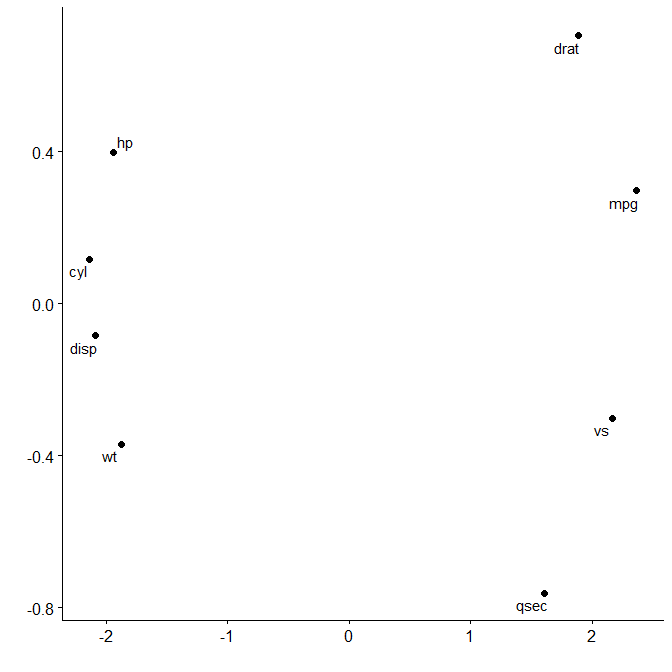
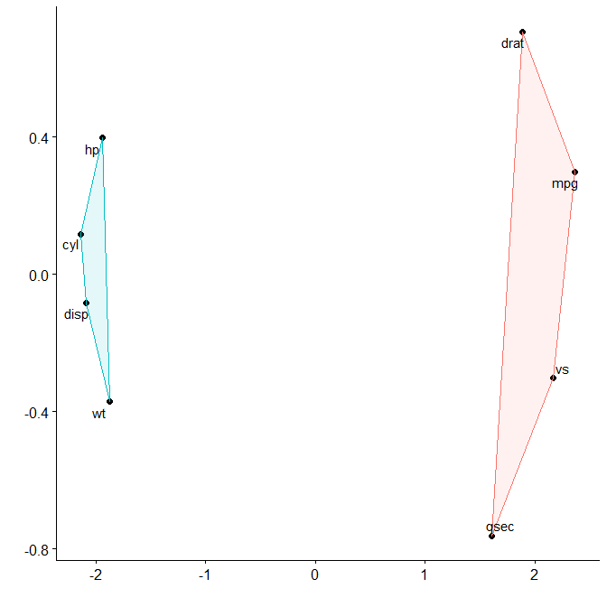
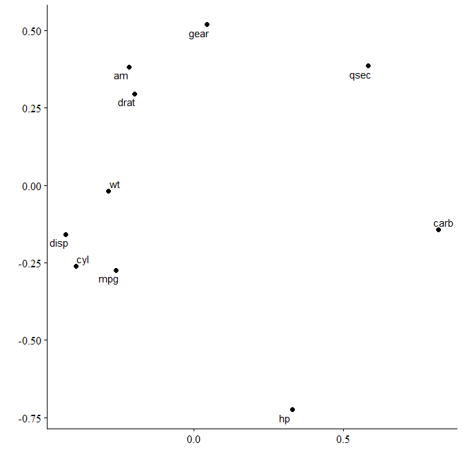

<!-- README.md is generated from README.Rmd. Please edit that file -->

# corx

<!-- badges: start -->


[](https://cran.r-project.org/package=corx)
[](https://github.com/conig/corx/actions)
[](https://github.com/conig/corx/actions/workflows/R-CMD-check.yaml)
<!-- badges: end -->

‘corx’ aims to be a Swiss Army knife for correlation matrices.
Formatting correlation matrices for academic tables can be challenging.
‘corx’ does all the heavy lifting for you. It runs the correlations, and
stores all relevant results in a list. Results can be formatted into
data.frames which can then easily be rendered into tables in a variety
of formats.

## Installation

You can install the released version of corx from
[CRAN](https://CRAN.R-project.org) with:

``` r
install.packages("corx")
```

To try features in development, you can install corx from github

``` r
remotes::install_github("conig/corx@devel")
```

## Example

## Basic usage

The simplest way to use corx is to supply it with a data.frame, which
houses numeric variables.

``` r
library(corx)
x <- corx(mtcars)
x
#> corx(data = mtcars)
#> 
#> ----------------------------------------------------------------------------
#>          mpg     cyl    disp      hp    drat      wt    qsec      vs      am
#> ----------------------------------------------------------------------------
#> mpg       -  -.85*** -.85*** -.78***  .68*** -.87***    .42*  .66***  .60***
#> cyl  -.85***      -   .90***  .83*** -.70***  .78*** -.59*** -.81***  -.52**
#> disp -.85***  .90***      -   .79*** -.71***  .89***   -.43* -.71*** -.59***
#> hp   -.78***  .83***  .79***      -   -.45**  .66*** -.71*** -.72***    -.24
#> drat  .68*** -.70*** -.71***  -.45**      -  -.71***     .09    .44*  .71***
#> wt   -.87***  .78***  .89***  .66*** -.71***      -     -.17 -.55*** -.69***
#> qsec    .42* -.59***   -.43* -.71***     .09    -.17      -   .74***    -.23
#> vs    .66*** -.81*** -.71*** -.72***    .44* -.55***  .74***      -      .17
#> am    .60***  -.52** -.59***    -.24  .71*** -.69***    -.23     .17      - 
#> gear   .48**  -.49** -.56***    -.13  .70*** -.58***    -.21     .21  .79***
#> carb  -.55**   .53**    .39*  .75***    -.09    .43* -.66*** -.57***     .06
#>         gear    carb
#> mpg    .48**  -.55**
#> cyl   -.49**   .53**
#> disp -.56***    .39*
#> hp      -.13  .75***
#> drat  .70***    -.09
#> wt   -.58***    .43*
#> qsec    -.21 -.66***
#> vs       .21 -.57***
#> am    .79***     .06
#> gear      -      .27
#> carb     .27      - 
#> ----------------------------------------------------------------------------
#> Note. * p < 0.05; ** p < 0.01; *** p < 0.001
```

## Partial correlations

To calculate correlations controlling for other variables, use the ‘z’
argument.

``` r
x <- corx(mtcars, z = wt, caption = "Correlations controlling for weight")
x
#> corx(data = mtcars, z = wt, caption = "Correlations controlling for weight")
#> 
#> Correlations controlling for weight
#> -------------------------------------------------------------------------------
#>         mpg     cyl    disp      hp  drat    qsec      vs     am   gear    carb
#> -------------------------------------------------------------------------------
#> mpg      -   -.56**    -.34  -.55**   .18   .55**    .44*    .00   -.06   -.40*
#> cyl  -.56**      -   .72***  .68***  -.33 -.74*** -.73***    .04   -.07     .34
#> disp   -.34  .72***      -   .60***  -.24 -.62*** -.57***    .07   -.10     .04
#> hp   -.55**  .68***  .60***      -    .04 -.80*** -.57***   .39*   .42*  .69***
#> drat    .18    -.33    -.24     .04    -     -.05     .08   .43*  .50**     .34
#> qsec  .55** -.74*** -.62*** -.80***  -.05      -   .79*** -.49**  -.39* -.65***
#> vs     .44* -.73*** -.57*** -.57***   .08  .79***      -   -.36*   -.17   -.44*
#> am      .00     .04     .07    .39*  .43*  -.49**   -.36*     -  .67***   .54**
#> gear   -.06    -.07    -.10    .42* .50**   -.39*    -.17 .67***     -   .71***
#> carb  -.40*     .34     .04  .69***   .34 -.65***   -.44*  .54** .71***      - 
#> -------------------------------------------------------------------------------
#> Note. * p < 0.05; ** p < 0.01; *** p < 0.001
```

## Asymmetric correlation matrices

Sometimes you only want the relationships for a subset of variables.
Asymmetric matrices are useful in these instances. The arguments ‘x’ and
‘y’ can be used to achieve this. ‘x’ sets row variables, ‘y’ sets column
variables.

``` r
x <- corx(mtcars, x = c(mpg, wt))
x
#> corx(data = mtcars, x = c(mpg, wt))
#> 
#> -------------------
#>         mpg      wt
#> -------------------
#> mpg      -  -.87***
#> wt  -.87***      - 
#> -------------------
#> Note. * p < 0.05; ** p < 0.01; *** p < 0.001
```

``` r
x <- corx(mtcars,
          x = c(mpg, wt),
          y = c(hp, gear, am))
x
#> corx(data = mtcars, x = c(mpg, wt), y = c(hp, gear, am))
#> 
#> ---------------------------
#>          hp    gear      am
#> ---------------------------
#> mpg -.78***   .48**  .60***
#> wt   .66*** -.58*** -.69***
#> ---------------------------
#> Note. * p < 0.05; ** p < 0.01; *** p < 0.001
```

## Changing formatting

Users can further customise the table for publication. For instance, the
numbers of significance stars can be changed, the area above the
diagonal omitted, and captions and notes added.

``` r
x <- corx(mtcars[,1:5],
          stars = c(0.05),
          triangle = "lower",
          caption = "An example correlation matrix")
x
#> corx(data = mtcars[, 1:5], stars = c(0.05), triangle = "lower", 
#>     caption = "An example correlation matrix")
#> 
#> An example correlation matrix
#> -------------------------------
#>             1     2     3     4
#> -------------------------------
#> 1. mpg     -                   
#> 2. cyl  -.85*    -             
#> 3. disp -.85*  .90*    -       
#> 4. hp   -.78*  .83*  .79*    - 
#> 5. drat  .68* -.70* -.71* -.45*
#> -------------------------------
#> Note. * p < 0.05
```

## Adding descriptive statistics

We can also add in descriptive statistics easily.

``` r
x <- corx(mtcars[,1:5],
          stars = c(0.05, 0.01, 0.001),
          triangle = "lower",
          caption = "An example correlation matrix",
          describe = c(M = mean, SD = sd, kurtosis))
x          
#> corx(data = mtcars[, 1:5], stars = c(0.05, 0.01, 0.001), triangle = "lower", 
#>     caption = "An example correlation matrix", describe = c(M = mean, 
#>         SD = sd, kurtosis))
#> 
#> An example correlation matrix
#> -------------------------------------------------------------
#>               1       2       3      4      M     SD kurtosis
#> -------------------------------------------------------------
#> 1. mpg       -                          20.09   6.03     2.80
#> 2. cyl  -.85***      -                   6.19   1.79     1.32
#> 3. disp -.85***  .90***      -         230.72 123.94     1.91
#> 4. hp   -.78***  .83***  .79***     -  146.69  68.56     3.05
#> 5. drat  .68*** -.70*** -.71*** -.45**   3.60   0.53     2.44
#> -------------------------------------------------------------
#> Note. * p < 0.05; ** p < 0.01; *** p < 0.001
```

To add descriptive columns describe can be set to any combination of the
following values:
c(“mean”,“sd”,“median”,“iqr”,“var”,“skewness”,“kurtosis”).

Alternatively, you can pass a list of named functions:

``` r
x <- corx(mtcars[,1:8], describe = list(Mean = function(x) mean(x),
                                        SD = function(x) sd(x)))
x
#> corx(data = mtcars[, 1:8], describe = list(Mean = function(x) mean(x), 
#>     SD = function(x) sd(x)))
#> 
#> ---------------------------------------------------------------------------
#>          mpg     cyl    disp      hp    drat      wt    qsec      vs   Mean
#> ---------------------------------------------------------------------------
#> mpg       -  -.85*** -.85*** -.78***  .68*** -.87***    .42*  .66***  20.09
#> cyl  -.85***      -   .90***  .83*** -.70***  .78*** -.59*** -.81***   6.19
#> disp -.85***  .90***      -   .79*** -.71***  .89***   -.43* -.71*** 230.72
#> hp   -.78***  .83***  .79***      -   -.45**  .66*** -.71*** -.72*** 146.69
#> drat  .68*** -.70*** -.71***  -.45**      -  -.71***     .09    .44*   3.60
#> wt   -.87***  .78***  .89***  .66*** -.71***      -     -.17 -.55***   3.22
#> qsec    .42* -.59***   -.43* -.71***     .09    -.17      -   .74***  17.85
#> vs    .66*** -.81*** -.71*** -.72***    .44* -.55***  .74***      -    0.44
#>          SD
#> mpg    6.03
#> cyl    1.79
#> disp 123.94
#> hp    68.56
#> drat   0.53
#> wt     0.98
#> qsec   1.79
#> vs     0.50
#> ---------------------------------------------------------------------------
#> Note. * p < 0.05; ** p < 0.01; *** p < 0.001
```

## Making tables

Corx objects can be passed directly to papaja::apa_table(), or
knitr::kable().

``` r
corx(mtcars[, 1:5], triangle = "lower", describe = c(mean, sd)) |>
  knitr::kable(caption = "My correlation matrix")
```

|          | 1          | 2          | 3          | 4        | mean   | sd     |
|:---------|:-----------|:-----------|:-----------|:---------|:-------|:-------|
| 1\. mpg  | \-         |            |            |          | 20.09  | 6.03   |
| 2\. cyl  | -.85\*\*\* | \-         |            |          | 6.19   | 1.79   |
| 3\. disp | -.85\*\*\* | .90\*\*\*  | \-         |          | 230.72 | 123.94 |
| 4\. hp   | -.78\*\*\* | .83\*\*\*  | .79\*\*\*  | \-       | 146.69 | 68.56  |
| 5\. drat | .68\*\*\*  | -.70\*\*\* | -.71\*\*\* | -.45\*\* | 3.60   | 0.53   |

My correlation matrix

## Making plots

### Correlation matrices

There are many useful functions for plotting correlation matrices.
‘corx’ contains a plot function which uses the ‘ggcorrplot’ package.

``` r
plot(x)
```



### Multidimensional scaling

Multidimensional scaling enables similarities between variables to be
converted to 2D distances. This lets us visualise how variables cluster
together.

``` r
plot_mds(x)
```



We can see that variables in mtcars cluster together in two separate
groups. If we want to highlight this we can request two clusters to be
marked.

``` r
plot_mds(x, 2)
```



You can see that miles per gallon, the number of cylinders, the
displacement rate, and the weight of the car are all closely related.
